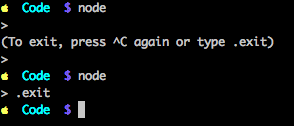

# Node REPL

## Overview

Node REPL is the easiest way to get started with Node. You'll see that executing Node is straightforward and not intimidating at all. ;)


## Objectives

1. Define REPL
1. Show how to launch REPL
1. Demo how to run Node in REPL
1. Show how to exit REPL

## REPL

What is you want to run some small code like a one-liner function or test out something, for see how a string function changes a substring? Or maybe you're working with dates and want to convert from one format to another. Saving code to a file each time you experiment, and running that file can be slow. There's a better way... meat REPL!

REPL stands for read-evaluate-print loop and it is exactly what it's doing. It take your command, executes it and prints the result if any. It looks similar to a command prompt or a terminal, but with an angle bracket `>` instead of the dollar `$` or some other command prompt sign. 

The commands in REPL are Node code. They are written in JavaScript or to be specific in one of the implementations of the ECMAScript standard, because browser JavaScript is just an implementation of this standard.

Another way to think about REPL is as an environment in which we can run Node code. Many other languages and platforms also have a similar REPL environment. Browser JavaScript can be run in the console of Google Chrome DevTools.

## Launching REPL

To launch Node REPL you need to have these things ready:

1. Node.js installed
2. Terminal app a.k.a. command prompt on Windows
3. `node` as the global command by exporting the path. This is done automatically if you used Node one-click installer from the website.

Open your terminal app. Most likely, you will see a dollar sign on Mac and Unix/Linux. This means you're in bash (Born Again Shell) or a similar shell environment. Now type `node`:

```
$ node
```

And hit enter. If you have Node installed properly, you'll see a pointy brace `>`. 

**Note:** I've seen a few beginners to Node trying to execute shell command in the REPL. For example, creating a folder which is `$ mkdir NAME`. Normal shell commands would not and should not work in REPL, because REPL is a Node environment and it uses Node language, not shell. The giveaway sign of REPL is that you have the angle bracket `>`. Remember that when you run into `SyntaxError: Unexpected identifier` errors. All you need to do is open a new terminal window or exit REPL.

## Running Node in REPL

We can run pretty much any code in REPL. Let's do some math:

```
> 1+1
2
> 13-3
10
> 10 % 3
1
```

Now let's define an expression (function which returns a value) which take two parameters and returns the sum of them. 

```
> var sum = function(a, b) { return a+b}
undefined
```

REPL printed `undefined`, because assignment is not an expression. Don't freak out. We created our function and stored the reference in the `sum` variable. We can check it by typing `sum` and pressing enter. The `sum` is a function so the previous statement worked just fine:

```
> sum
[Function]
```

Let's compare how our new expression `sum` works by using comparison operand `===`. The results are printed on the next line and they are booleans:

```
> 1+1 === sum(1,1)
true
> 2+2 === sum(2,2)
true
> 2+2 === sum(2,5)
false
```

So we can create function, variable, invoke them and pass around argument just like in DevTools. You saw that you can type some code and see results immediately. REPL is good for quickly testing your code. REPL is the easiest way among others to run your Node code.

## Exiting REPL

Exiting REPL is straightforward. All you need to do is close the window. This will terminate the process. If you want to keep the window, you type:

```
> .exit
```

Or you can press control + c twice.



## Resources

1. [REPL official docs](https://nodejs.org/api/repl.html)
2. [Node.js Getting Started - Using the REPL and Running Files](https://www.youtube.com/watch?v=85_wGYPmsno)
3. [Using the Chrome DevTools Console](https://developer.chrome.com/devtools/docs/console)
4. [How do I use node's REPL?](https://docs.nodejitsu.com/articles/REPL/how-to-use-nodejs-repl)

---

<a href='https://learn.co/lessons/node-repl' data-visibility='hidden'>View this lesson on Learn.co</a>
